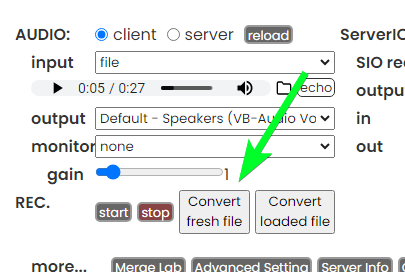

# W-Okada Voice Changer Scripts

Some scripts for the w-okada voice-changer. (run in dev-tools and/or chrome userscripts)

## Usage

### In-app dev-tools

1) Open the dev-tools console in the W-Okada Voice Changer electron app. (ctrl+shift+i, then open the "Console" tab)
2) Copy all of the code in `Dist/index.js`, paste it into the console, then hit Enter.

### Chrome user-scripts

1) Open the client frontend in your regular browser, by going to `http://127.0.0.1:18888` (or `http://localhost:18888`).
2) Add a user-script for the site, using an extension such as Grease Monkey or Violent Monkey, with its contents being that of the `Dist/index.js` file in this repo. (not yet tested, but will likely work)

## Scripts

If one or more of these scripts have behavior you do not want, you can avoid activation of that script by commenting out its line at the very end of the `Dist/index.js` file, prior to running it in the app's dev-tools console.

### MyStartupTweaks

Changes:
* Allows voice list to expand taller.
* Reduces margin between the control groups.
* Auto-sets the "RVC Quality" (in Advanced Settings panel) to "High". (set on script init, and whenever the voice is changed)

### AddDirectFileConvertButtons

Changes:
* Adds a "Convert fresh file" button; this lets you select an audio file, and have it sent directly to the backend for conversion. (no fiddling with starting/stopping recording, or worrying about the conversion delay causing lost audio or additional silence)
* Adds a "Convert loaded file" button; like the one above, except uses the file loaded as the "input:file" content within the audio->client control group.

## Tasks

* [ ] Simplify the direct file-conversion functions to avoid the unnecessary i16->f32->16 conversion chain (after receiving the converted audio from the backend).